Source: https://github.com/getdokan/plugin-internal-tasks/issues/349#issuecomment-2735270004

### Apply Coupon to Cart & Order:
Filepath: [includes/Vendor/Coupon.php (Lite)](../includes/Vendor/Coupon.php#L21)

### Remove Coupon From Order:
Filepath: [includes/Vendor/Coupon.php (Lite)](../includes/Vendor/Coupon.php#L23)

```mermaid
graph TD;
    A[Triggered by deleting a WC_Order_Item_Coupon] --> B[Initialize WC_Order_Item_Coupon with $item_id];
    B --> C{Does it have an Order ID?};
    C -- No --> Z[Return early];
    C -- Yes --> D[Get coupon code & order];
    D --> E[Remove coupon discount from order items];
    E --> F{Order has sub-orders?};

    F -- Yes --> G[Remove coupon from all child orders];

    F -- No --> H{Has it parent?};
    H -- Yes --> I[Get parent order];
    I --> J[Filter parent items with matching product IDs];
    J --> K[Remove coupon discount from matching parent items];
    H -- No --> Z1[No parent order — nothing else to do];
```

### Validation Flowchart

