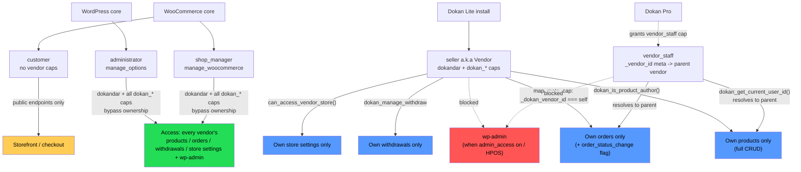

# Dokan Roles & Permissions (RBAC Reference)

Canonical reference for Dokan's role-based access control: WP roles, custom
capabilities, ownership-scoping helpers, and enforcement patterns in REST
controllers, `map_meta_cap`, and the WC Abilities/MCP scoping layer.

## 1. Roles

Dokan Lite registers **one** custom WP role and extends two core roles.

| Role | Source | Notes |
|---|---|---|
| `seller` ("Vendor") | Dokan Lite, `includes/Install/Installer.php:162-214` (`Installer::user_roles()`, runs on activation) | Marker capability `dokandar` + WP content caps + all `dokan_*` custom caps. |
| `administrator` | WP core | Granted `dokandar` + all `dokan_*` custom caps at install (`Installer.php:207,211`). Bypasses ownership checks via `manage_options`. |
| `shop_manager` | WooCommerce core | Granted `dokandar` + all `dokan_*` custom caps at install (`Installer.php:206,212`). Treated as store-admin equivalent via `manage_woocommerce`. |
| `customer` | WooCommerce core | Untouched by Dokan's `add_role`/`add_cap`. No vendor-facing capability. |
| `vendor_staff` | **Dokan Pro only** — not registered in Lite | Not a WP role; a capability (`vendor_staff`) + `_vendor_id` user meta pointing at the parent vendor. Lite contains the resolution plumbing but Pro grants the capability. |

Base capabilities granted to `seller` at registration (`Installer.php:169-197`):
`read`, `publish_posts`, `edit_posts`, `delete_published_posts`,
`edit_published_posts`, `delete_posts`, `manage_categories`,
`moderate_comments`, `upload_files`, `edit_shop_orders`, `edit_product`,
`read_product`, `delete_product`, `edit_products`, `publish_products`,
`read_private_products`, `delete_products`, `delete_private_products`,
`delete_published_products`, `edit_private_products`,
`edit_published_products`, `manage_product_terms`, `delete_product_terms`,
`assign_product_terms`, `dokandar`.

A user becomes a seller via `$user->add_role( 'seller' )`
(`includes/functions.php:4306`).

## 2. Capability model

No dedicated `Cap`/`Capabilities` class — the capability list is a plain
function, `dokan_get_all_caps()` (`includes/functions.php:2771-2834`,
filterable via `dokan_get_all_cap`). Labels: `dokan_get_all_cap_labels()`
(`includes/functions.php:2845-2860`).

Grouped custom capabilities (all `seller`/`shop_manager`/`administrator` get
every one of these at install):

| Group | Capabilities |
|---|---|
| overview | `dokan_view_sales_overview`, `dokan_view_sales_report_chart`, `dokan_view_announcement`, `dokan_view_order_report`, `dokan_view_review_reports`, `dokan_view_product_status_report` |
| report | `dokan_view_overview_report`, `dokan_view_daily_sale_report`, `dokan_view_top_selling_report`, `dokan_view_top_earning_report`, `dokan_view_statement_report` |
| order | `dokan_view_order`, `dokan_manage_order`, `dokan_manage_order_note`, `dokan_manage_refund`, `dokan_export_order` |
| coupon | `dokan_add_coupon`, `dokan_edit_coupon`, `dokan_delete_coupon` |
| review | `dokan_view_reviews`, `dokan_manage_reviews` |
| withdraw | `dokan_manage_withdraw` |
| product | `dokan_add_product`, `dokan_edit_product`, `dokan_delete_product`, `dokan_view_product`, `dokan_duplicate_product`, `dokan_import_product`, `dokan_export_product` |
| menu (vendor dashboard sidebar) | `dokan_view_overview_menu`, `dokan_view_product_menu`, `dokan_view_order_menu`, `dokan_view_coupon_menu`, `dokan_view_report_menu`, `dokan_view_review_menu`, `dokan_view_withdraw_menu`, `dokan_view_store_settings_menu`, `dokan_view_store_payment_menu`, `dokan_view_store_shipping_menu`, `dokan_view_store_social_menu`, `dokan_view_store_seo_menu` |

In Pro, individual staff members get a subset of these toggled on; in Lite
they're a blanket grant to the three roles above.

**Gate capabilities used throughout the codebase:**

- `dokandar` — synthetic "is this user a vendor" flag. Not a core WP/WC cap.
  Checked via `current_user_can('dokandar')` / `user_can($id,'dokandar')`
  (e.g. `includes/functions.php:82,1236`, `includes/REST/ProductController.php:502`,
  `includes/Traits/VendorAuthorizable.php:17`).
- `manage_woocommerce` (WC core) — "is store admin" (admin or shop manager).
- `manage_options` (WP core) — "is site super-admin".

## 3. Role helper functions

| Function | File:Line | Behavior |
|---|---|---|
| `dokan_get_current_user_id()` | `includes/functions.php:52-65` | Current user ID, unless they hold `vendor_staff`, in which case resolves to the parent vendor via user meta `_vendor_id` (falls back to the staff's own ID if empty). This is the primary staff→vendor resolution point used across REST and the Abilities scoping layer. |
| `dokan_is_user_seller( $user_id, $exclude_staff = false )` | `includes/functions.php:77-83` | `user_can($user_id,'dokandar')`; with `$exclude_staff = true`, returns `false` for anyone also holding `vendor_staff` (isolates true vendor owners). |
| `dokan_is_user_customer( $user_id )` | `includes/functions.php:92-98` | Whether the user has the core `customer` role. |
| `dokan_is_seller_enabled( $user_id )` | `includes/functions.php:1108-1113` | User meta `dokan_enable_selling === 'yes'` (filterable `dokan_is_seller_enabled`). Whether the store is live, independent of role. |
| `dokan_is_seller_trusted( $user_id )` | `includes/functions.php:1122-1126` | User meta `dokan_publishing === 'yes'` — whether the vendor's products auto-publish without admin review. |
| `dokan_is_product_author( $product_id = 0 )` | `includes/functions.php:148` | Compares product `post_author` against the current user (staff-resolved). Used by REST product ownership checks. |
| `dokan_media_uploader_restrict( $args )` | `includes/functions.php:1231-1243` | No restriction for `manage_woocommerce`; for `dokandar`, restricts the media library query to `author = dokan_get_current_user_id()`. |
| `dokan_get_seller_id_by_order( $order )` / `dokan_get_seller_id_by_order_id( $order_id )` | `includes/Order/functions.php:296,826` | Resolves the vendor owning an order. Used by order permission checks (REST and Abilities scoping). |

Admin-equivalent checks are done inline rather than via a helper:
`current_user_can('manage_woocommerce')` (store-admin) and
`current_user_can('manage_options')` (site-admin) — e.g.
`includes/Core.php:76`, `includes/REST/StoreController.php:462,519,782`,
`includes/REST/OrderController.php:801`.

## 4. Vendor staff (Pro)

Not a registered WP role in Lite, but Lite fully models the relationship so
Pro can layer the role on top.

- **Linkage:** staff user holds capability `vendor_staff` + user meta
  `_vendor_id` → parent vendor ID.
- **Resolver:** `VendorUtil::get_vendor_id_for_user( $user_id = 0 )`
  (`includes/Utilities/VendorUtil.php:72-87`):
  - Vendor owner (`dokan_is_user_seller($id, true)`) → own ID.
  - Has `vendor_staff` cap → `_vendor_id` meta (parent vendor).
  - Otherwise → `0`.
- **`WeDevs\Dokan\Traits\VendorAuthorizable`** (`includes/Traits/VendorAuthorizable.php`)
  — shared authorization surface used by REST controllers:
  - `check_permission()` (`:16-18`) → `current_user_can('dokandar')`.
  - `can_access_vendor_store( $vendor_id, $user_id = 0 )` (`:36-58`) — the
    four-tier model: admin (`manage_woocommerce`) → any store; vendor owner →
    own store only; staff → only their assigned vendor's store (via
    `get_vendor_id_for_user`); anyone else → denied.
  - `get_vendor_id_for_user()` (`:76-78`) → delegates to `VendorUtil`.
  - `validate_store_id()` (`:99-112`) → REST param validation that a store ID
    resolves to a real vendor/staff-parent.
  - `is_staff_only( $user_id )` (`:122-124`) → `true` only for staff who are
    not also a vendor owner.
- Staff share the parent vendor's data scope (queries resolve to the parent's
  ID) but are still blocked from wp-admin same as sellers
  (`includes/Core.php:52`, blocked-role list `['seller','customer','vendor_staff']`).
- Also referenced in `includes/Rewrites.php:201` (store URL rewrites exclude
  staff from being a distinct store owner) and `includes/functions.php:1879`.

## 5. REST permission patterns

General pattern across controllers: `manage_options` = super-admin bypass,
`manage_woocommerce` = store-admin bypass, `dokandar` = "is a vendor" gate,
`dokan_*` custom caps = feature/menu gates, ownership checks
(`dokan_is_product_author`, `dokan_get_seller_id_by_order`,
`can_access_vendor_store`) enforce "vendor touches only their own data."

**`includes/REST/ProductController.php`**
- `get_product_permissions_check()` (`:473-475`) — `dokan_view_product_menu` OR `manage_options`.
- `create_product_permissions_check()` (`:484-486`) — `dokan_add_product` OR `manage_options`.
- `get_single_product_permissions_check()` (`:496-517`) — admin (`manage_options`) always allowed; else requires `dokandar` + `dokan_is_product_author($id)` (own product only).
- `update_product_permissions_check()` / `delete_product_permissions_check()` (`:526-538`) — capability-only (`dokan_edit_product` / `dokan_delete_product`) OR `manage_options`; ownership enforced deeper in the handler (`:434,459`), not at the permission-callback layer.

**`includes/REST/OrderController.php`**
- `get_orders_permissions_check()` (`:789-791`) — `dokan_view_order_menu`.
- `get_single_order_permissions_check()` (`:800-812`) — `shop_manager`/`administrator` → allow; else `dokan_get_seller_id_by_order($id) === get_current_user_id()` (owner-only; no staff resolution here).
- `update_order_permissions_check()` (`:821-833`) — requires `dokan_manage_order` AND the site setting `order_status_change` (option group `dokan_selling`) is `on` — an admin-controlled feature flag on top of capability.

**`includes/REST/StoreController.php`**
- Most read routes are public (`__return_true`); admin-only management sub-resources go through `permission_check_for_manageable_part()` (`:519-521`) = `current_user_can('manage_woocommerce')`.
- `update_store_permissions_check()` (`:376-383`) — resolves the requested ID to a real vendor ID via `get_vendor_id_for_user()` (staff→parent aware) then `can_access_vendor_store($store_id)` — the most complete owner/admin/staff pattern in the codebase, reused at `:417,729,780`.
- `:462-463,782-785` — `manage_options` (admin) plus `dokan_is_user_seller(get_current_user_id(), true)` (excludes staff) for "true vendor owner" report/summary endpoints.

## 6. `map_meta_cap` usage

Only one filter in Dokan Lite: `includes/Order/Admin/Permissions.php`.

- Registered: `add_filter('map_meta_cap', [$this,'map_meta_caps'], 12, 4)` (`:24`), `is_admin()`-only.
- `map_meta_caps()` (`:51-72`) — for `edit_post` / `edit_others_shop_orders` on a shop order, reads order meta `_dokan_vendor_id`; if it matches the current user, remaps the required cap down to plain `edit_shop_orders` (which `seller` already has). This is how a vendor edits their own order in wp-admin despite lacking `edit_others_shop_orders`. No match → original caps pass through unchanged → denied.
- Products have **no** `map_meta_cap` filter — product ownership is enforced entirely at the REST permission-callback / query level, not via meta-cap remapping. (WP's own `map_meta_cap` for the `product` post type still denies `edit_others_products` to a `seller`, since that capability was never granted — see §1's base cap list.)
- The same class scopes the wp-admin Orders list table to `_dokan_vendor_id = current vendor` for non-`manage_woocommerce` users (`posts_clauses` / `woocommerce_order_list_table_prepare_items_query_args`, `:26-29`) and hides order-status-change UI when `order_status_change` is off (`:161-224`).

## 7. WC Abilities / MCP scoping layer

Separate, additive RBAC layer for WooCommerce's Abilities API (MCP tool
calls) — `includes/Abilities/`. Only active when
`RequestContext::is_mcp_request()` is true; normal storefront/REST/admin
traffic is untouched.

`is_mcp_request()` (`includes/Abilities/Support/RequestContext.php:86-100`) is
true via **either** of two independent signals, not URL detection alone:

1. **Ability-execution context** — `is_executing_ability()` (`:109-111`): true
   whenever any registered ability is currently running
   (`wp_before_execute_ability`/`wp_after_execute_ability`), regardless of
   which MCP server (or non-MCP caller) invoked it. This is the primary,
   server-agnostic signal.
2. **Adapter pre-flight flag** — `flag_mcp_request()` (`:152-156`), set the
   moment the MCP adapter begins a tool call, before any ability-execution
   window opens (needed because the adapter checks the target ability's
   permission callback *before* `wp_before_execute_ability` fires).

A URL match against `/(?:woocommerce|dokan)/mcp(?:/|$)` (`:205-215`) is only a
secondary fallback, and the whole result is filterable via
`dokan_is_mcp_request`. In short: **any ability execution is treated as MCP
context**, not just requests hitting a known MCP endpoint — so integrations
should not assume a non-MCP-URL ability call is unscoped.

- `ProductAbilityScope` — published products public to any caller; unpublished
  readable only by owner or `manage_woocommerce`. List queries: own-store
  filter (`vendor_id` == caller) allows all statuses, any other filter (or
  none) forces `post_status = publish`. Product-create forces authorship to
  the resolved vendor (self for vendor/staff, explicit valid `vendor_id` for
  admin). Write (edit/delete) permission for single objects is **not**
  re-implemented here — deferred to WP's native `map_meta_cap`, which already
  denies cross-vendor edits since `seller` lacks `edit_others_products`.
- `OrderAbilityScope` — orders private to the owning vendor
  (`dokan_get_seller_id_by_order`) for **every** context (read/edit/delete),
  admins unscoped. List queries constrained to `dokan()->order->all(seller_id
  => caller)` (HPOS + legacy CPT + REST). Multi-vendor parent/sub-order
  relationship annotated on output so totals aren't double-counted.
- `Definitions/*` (`dokan/current-vendor`, `dokan/vendor-stats-get`,
  `dokan/withdraws-query`, `dokan/vendors-query`) — Dokan-native abilities,
  all self-scoped via `dokan_get_current_user_id()`; no caller-supplied vendor
  ID that could override scope. `dokan/vendors-query` is intentionally public
  (mirrors the existing public store directory REST endpoint).
- Test coverage: `tests/php/src/Abilities/*Test.php` (57 tests) exercises the
  full matrix — own-store-all-statuses, other-vendor-published-only,
  admin-sees-all, single-order cross-vendor denial (read *and* write),
  create-forced-to-own-store, admin-must-select-vendor.

## 8. Summary by role

**administrator** — `dokandar` + all `dokan_*` caps at install. Bypasses
ownership via `manage_options` (top-priority `true` branch in nearly every
permission callback). Full access to all vendors' products, orders,
withdrawals, store settings, plus wp-admin.

**shop_manager** — `dokandar` + all `dokan_*` caps at install. Store-admin
equivalent via `manage_woocommerce`. Views/manages all vendors' orders, all
store-settings sub-resources, not blocked from wp-admin (the block list is
`seller`/`customer`/`vendor_staff` only).

**seller ("Vendor")** — Full CRUD on own products only (ownership via
`dokan_is_product_author` / post_author). Orders scoped to `_dokan_vendor_id
=== self` via `map_meta_cap` + list-table query filters, further gated by
`dokan_view_order_menu`/`dokan_manage_order` and the `order_status_change`
site setting. Withdrawals gated by `dokan_manage_withdraw`. Store settings
gated by `dokan_view_store_*_menu` caps, updates via
`can_access_vendor_store` (owner-only). Blocked from wp-admin when
`dokan_general.admin_access` is on (default) or HPOS is enabled
(`includes/Core.php:37-56`). Media library restricted to own uploads.

**customer** — Unmodified WC core role. No vendor-facing capability. Blocked
from wp-admin same as sellers when `admin_access` is on. Interacts only as a
storefront/checkout buyer via public endpoints.

**vendor_staff (Pro only)** — Not in Lite's role table, but capability +
`_vendor_id` meta fully modeled. Data scope resolves to the parent vendor
everywhere (`dokan_get_current_user_id()`, `VendorUtil`,
`VendorAuthorizable`). Blocked from wp-admin like sellers. Pro presumably
grants a per-staff subset of the `dokan_*` custom caps rather than the full
set a vendor owner gets.

## Open questions / not yet verified in code

- Exact set of `dokan_*` caps Pro assigns per staff member (staff capability
  UI lives in Pro, not inspected here).
- Whether any REST/Abilities endpoint accepts a `vendor_id` override without
  validating it against `dokan_is_user_seller()` — spot-checked for the
  Abilities product/order/vendor endpoints (§7, all validated); not
  exhaustively checked across all 38 REST controllers.

## 9. Role overview diagram

